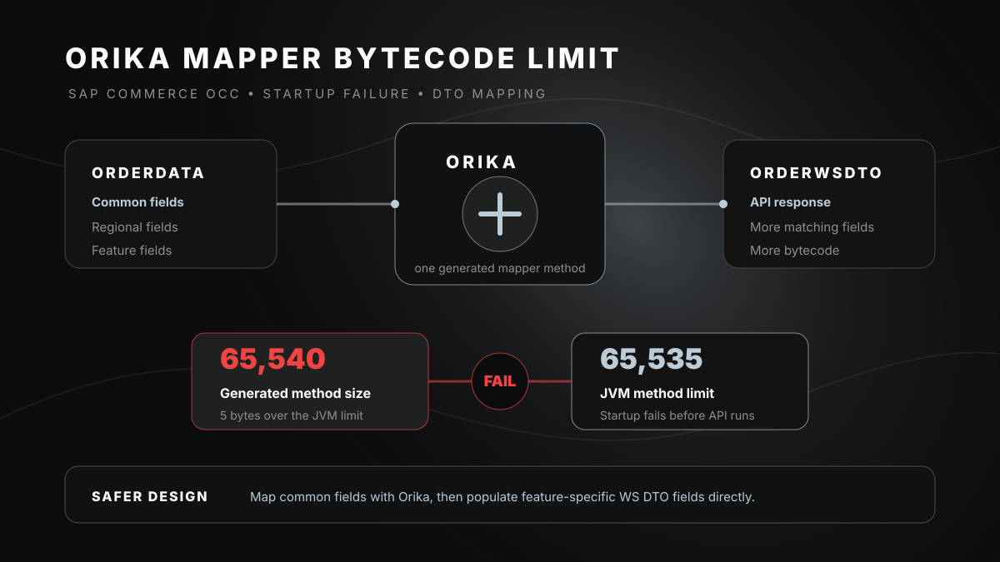

# SAP Commerce Performance Series: When Mapping Becomes Too Big

Recently, one of my colleagues was working on a feature enhancement where a small DTO change caused server startup to fail.

Once the issue came up, I stepped in to analyze what was failing and why it was happening.

At first, the error looked like a Spring bean creation issue.

But the actual root cause was deeper:

```text
java.lang.ClassFormatError: Invalid method Code length 65540
```

The JVM allows a maximum method bytecode size of `65535` bytes.

In this case, the generated mapper method crossed the limit by just **5 bytes**.

That was the interesting part.

The feature change itself was not very large. But the existing mapper was already very close to the JVM limit. A few additional mapped fields were enough to push it over.



## What Actually Happened?

In SAP Commerce OCC, we commonly map facade data objects to webservice DTOs.

Example:

```text
OrderData -> OrderWsDTO
```

This mapping is usually handled through the `dataMapper`, which internally uses Orika.

For smaller DTOs, this works smoothly.

But when a DTO grows over time with common fields, regional fields, and feature-specific fields, Orika may generate one very large mapping method.

At some point, the problem is no longer the business logic.

The problem is the size of the generated bytecode.

The failure chain looked like this:

```text
Controller
  -> dataMapper
    -> Orika mapper generation
      -> JVM bytecode limit exceeded
        -> server startup failed
```

## The Design Learning

One learning from this debugging exercise:

Not every new response field should automatically become part of the default Orika mapping.

Sometimes the better design is:

```text
Map common fields using Orika
Populate feature-specific fields manually on the WS DTO
```

This keeps the API response unchanged, but avoids increasing the already-heavy generated mapper.

Before:

```text
All common fields + feature fields
  -> one huge generated mapper
```

After:

```text
Common fields
  -> Orika mapping

Feature fields
  -> direct WS DTO enrichment
```

During the analysis, the important discussion was not only:

> Why did this fail?

It was also:

> Is this field needed in every order response?

> Should it be part of the default mapping?

> Can it be populated only for the feature flow?

> Are we increasing a shared DTO mapper for a use case that is not truly shared?

That changed how I looked at DTO design.

A large DTO is not just a response contract. It can also become a hidden startup risk when too much is pushed through automatic mapping.

## Checklist Before Adding Fields to Large OCC DTOs

Before adding fields to large OCC DTOs like order or cart responses, check:

- Is this field required by every API flow?
- Is it needed in all field-set levels?
- Is it feature-specific or region-specific?
- Will it increase an already large default mapper?
- Can it be populated directly after base mapping?

## Final Takeaway

The issue was not that the fields were wrong.

The issue was that too many fields were being mapped through one generated Orika method.

Sometimes the cleanest fix is not to remove the field.

It is to reduce what the mapper is responsible for.

---

**LinkedIn hashtags:**

`#SAPCommerce` `#Hybris` `#OCC` `#Java` `#Orika` `#PerformanceOptimization` `#CommerceCloud` `#CodeReview` `#SoftwareArchitecture`
